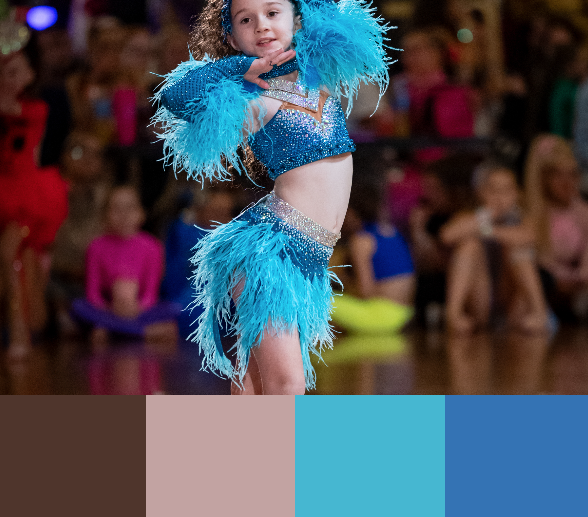

Welcome to,

# 🏆 Freestyle Fanatics 🏆

## Table of Contents
1. UX

  * Project Goals  
  * Dancer Goals  
  * Parental Goals   
  * Developer and Business Goals  
  * User Stories  
  * Design Choices  
  * Wireframes  

2. Features
  * Existing Features
  * Features left to implement

3. Technologies used

4. Testing

5. Deployment

  * How to run this project locally

6. Credits

  * Content
  * Media
  * Code
  * Acknowledgements

------

## UX

### Project Goals

The primary goal of Freestyle_dance is to provide a hub of all things freestyle to all aged 12 - adult with easy and clear navigation with signposting to external sites where necessary. 

#### Dancer Goals

The main target audeince for this website is dancers aged 12. and over.

Dancers and guardian goals are:

  * Navigate way around site easily.
  * Easily follow links to signposted pages.
  * Find the site informative, fun and engaging.
  * Know what the next steps to take are.
  * Inform parents of the website for them to assess the information.

Freestyle Fanatics can help dancers meet these goals by:

  * Providing relevant information and links all in one website.
  * Providing a simple and clear navigation bar.
  * Give dancers information about freestyle dance and relevant associated information.
  * Engaging images to allow dancer to know they have found the site for the 
    correct genre.
  * Same theme and layout for all pages.
  * Use a maximum of 3 clicks from start to end goal to minimise cognitive 
    overload.
  * The feel is engaging and informative.

#### User Story

As a current or aspiring freestyle dancer or dancers guardian i need to...
  * Find information about the freestyle dance genre.
  * Find where i can to learn to dance and who is qualified to teach me.
  * Learn about competitions and what is required to compete.
  * Be informed of regulatory associations.

### Design

  * Single column mobile first responsive design.

#### Colour Scheme

  * Four colours will be used in addition to black and white throughout the site to create a theme. The colour pallette was picked from the hero image on the home page. This should carry the site identity across all pages.

#### Typography

  * The Poppins font will be the main font used for the website on a whole and Sans Serif is to be used as a fallback font should for any reason the Poppins google font not load correctly to the website. Poppins is a crisp clear font that has rounded features that adds flow and creativity whilst having a corporate edge.

#### Imagery

  * Imagery is key to immediately letting the user know they are viewing the correct dance genre and engage quickly and convey a positive and energetic energy.

## Features

### Current Features

  * Mobile first design fully responsive.

## Technologies Used

### Languages Used
  
  * HTML5
  * CSS3

### Frameworks, Programs and Libraries Used

1. Bootstrap 4.3.1:
   Bootstrap was used to assist with the responsiveness and styling of the website.
2. Hover.css:
   Hover.css was used on the Social Media icons in the footer to add the float transition while being hovered over.
3. Google Fonts:
   Google fonts were used to import the 'Titillium Web' font into the style.css file which is used on all pages throughout the project.
4. Font Awesome:
   Font Awesome was used on all pages throughout the website to add icons for aesthetic and UX purposes.
5. jQuery:
   jQuery came with Bootstrap to make the navbar responsive but was also used for the smooth scroll function in JavaScript.
5. Git
   Git was used for version control by utilizing the Gitpod terminal to commit to Git and Push to GitHub.
6. GitHub:
   GitHub is used to store the projects code after being pushed from Git.
7. Balsamiq:
   Balsamiq was used to create the wireframes during the design process.