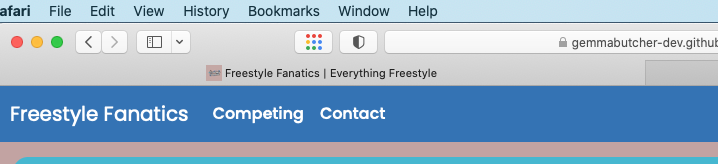
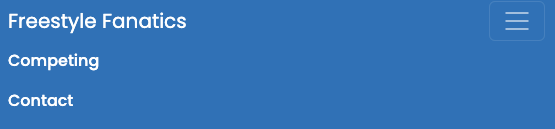

Welcome to

# 🏆 Freestyle Fanatics 🏆


[View the live project here.](https://gemmabutcher-dev.github.io/freestyle_dance/)

## Table of Contents
1. [UX](#ux)

  * Project Goals
  * Dancer Goals 
  * User Stories  
  * Design Choices
  * Wireframes

2. [Features](#features)

  * Existing Features
  * Features left to implement

3. [Technologies used](#technologies-used)

  * Languages Used
  * Frameworks, Programs and Libraries Used

4. [Testing](#testing)

  * Overall Peformance
  * Code Validation
  * Accessibility Testing
  * Bug Fixes
  * Hero Image Change
  * Testing User Stories from User Experience (UX) Section
  * Further Testing

5. [Deployment](#deployment)

  * GitHub Pages
  * Forking the GitHub Repository
  * Making a Local Clone

6. [Credits](#credits)

  * Content
  * Media
  * Code
  * Acknowledgements

------

## UX

### User Stories

#### Project Goals

The primary goal of Freestyle Fanatics is to provide a hub of all things freestyle to all aged 12 - adult with easy and clear navigation with signposting to external sites where necessary. 

#### Dancer Goals

The main target audeince for this website is dancers aged 12 and over.

Dancers and guardian goals are:

  * Navigate way around site easily.
  * Easily follow links to signposted pages.
  * Find the site informative, fun and engaging.
  * Know what the next steps to take are to learn to dance or compete and who is qualified to teach me.
  * Easily navigate to the facebook page to follow and interact.
  * Be able to contact the site owner.
  * To be informed of and able to locate regulatory associations. 
  * Be able to see a photo and video examples of freestyle dancing.

Freestyle Fanatics can help dancers meet these goals by:

  * Providing relevant information and links all in one website.
  * Providing a simple and clear navigation bar.
  * Give dancers information about freestyle dance and relevant associated information.
  * Engaging images and video to allow dancer to know they have found the site for the 
    correct genre.
  * Same theme and layout for all pages.
  * Use a maximum of 3 clicks from start to end goal to minimise cognitive 
    overload.
  * The feel is engaging and informative.
  * Using a Favicon on all pages.

### Design Choices

  * Single column mobile first responsive design.

#### Colour Scheme

  * Four colours will be used in addition to black and white throughout the site to create a theme. The colour pallette was picked from the hero image on the home page. This should carry the site identity across all pages.


#### Typography

  * The Poppins font will be the font used for the all headings on the website and Sans Serif is to be used as a fallback font should for any reason the Poppins google font not load correctly to the website. Poppins is a crisp clear font that has rounded features that adds flow and creativity whilst having a corporate edge.

  * The Roboto font will be the font used for the other text on the website and Sans Serif is to be used as a fallback font should for any reason the Roboto google font not load correctly to the website. Roboto is a sharper font that has less rounded features than Poppins having more of a corporate edge, complimenting the poppins font with increased ease of readability for smaller text.

#### Imagery

  * Imagery is key to immediately letting the user know they are viewing the correct dance genre and engage quickly and convey a positive and energetic vibe.
  * The initial imagery will be the hero sections on the index.html and competition.html pages.

  

  * A image carousel will be located on the homepage to engage and inform the user.
  * There will be a favicon in the browser bar on all pages helping with site identity and branding.

  

### Wireframes

  * There are 3 wireframes for the home page showing how the page will look on different devices. All other pages have been designed
    in mobile view. The mobile home wireframe is shown below.

  

  *  The tablet view wireframe can be viewed [here](docs/design/wireframes/tablet_wireframe.png) 

  * Desktop wireframe is shown below.
  
   

  * All other wireframes for all pages can be viewed [here](docs/design/wireframes). 

## Features

### Existing Features

  * Mobile first design fully responsive.
  * [Hero images](docs/design/screenshots/navbar.png) on index.html and competition.html.
  * [Navigation bar](docs/design/screenshots/navbar.png) and [footer](docs/design/screenshots/footer.png) used across all pages.
  * Navigation bar with toggle button (hamburger) on mobile and tablet devices.

  

  * Links to external sites.
  * Contact page with [contact form.](docs/design/screenshots/contact_form.png)
  * [iframe](docs/design/screenshots/iframe.png) with youtube video on competition page.

  

  * Image [carousel](docs/design/screenshots/carousel.png) on index.html homepage.
  * Use of [Favicon](docs/design/screenshots/favicon_browser.png) in browser bar.

  

  * Contact form submission landing page that redirects to homepage after 10 seconds.

  

  * 404 page.

  

### Features Left To Implement

  * Suppliers.html page with a directory to add functionality for the user.
  * A downloadable ADFP competition rule book. (Not yet released by the Association. Due December 2024)

## Technologies Used

### Languages Used
  
  * [HTML5](https://en.wikipedia.org/wiki/HTML5)
  * [CSS3](https://en.wikipedia.org/wiki/Cascading_Style_Sheets)

### Frameworks, Programs and Libraries Used

1. [Bootstrap 5.3](https://getbootstrap.com/):
   Bootstrap was used to assist with the responsiveness and styling of the website.
2. [Google Fonts](https://fonts.google.com/):
   Google fonts were used to import the 'Poppins' and 'Roboto' font into the style.css file which is used on all pages throughout the project.
3. [Font Awesome](https://fontawesome.com/):
   Font Awesome was used on all pages throughout the website to add icons for aesthetic and UX purposes.
4. jQuery:
   jQuery came with Bootstrap to make the navbar responsive but was also used for the smooth scroll function in JavaScript.
5. [Git](https://git-scm.com/):
   Git was used for version control by utilizing the Gitpod terminal to commit to Git and Push to GitHub.
6. [GitHub](https://github.com/):
   GitHub is used to store the projects code after being pushed from Git.
7. [Balsamiq](https://balsamiq.com/):
   Balsamiq was used to create the wireframes during the design process.
8. [Am i responsive?](https://ui.dev/amiresponsive):
   Am i reponsive was used to create the device mockup in README.md.
9. [ahrefs](https://ahrefs.com/writing-tools/img-alt-text-generator):
   ahrefs was used to help generate alt text for images.
10.[Canva](https://www.canva.com/colors/color-palette-generator/):
   Canva's color pallette generator was used to create a color pallette from the homepage hero image.

## Testing

### Overall Peformance

The complete site was tested on the lighthouse facility in Google Developer Tools to assess the overall performance of the site. The site meets the pass criteria and you can see the results in the below table.

| Page     | Screenshot                                                         | Notes                                        |
|----------|--------------------------------------------------------------------|----------------------------------------------|
|Home      |          |Some warnings for performance.                |
|Competing |  |Accessibility 100%. Performance could improve.|
|Contact   |       |Good overall.                                 |
|Submission|    |Very good overall.                            |
|404       |           |Good overall.                                 |          


### Code Validation

The W3C Markup Validator and W3C CSS Validator Services were used to validate every page of the project to ensure there were no syntax errors in the project.
The results and screenshots are in the table below.

| Page     | Screenshot                                                           | Notes  |
|----------|----------------------------------------------------------------------|--------|
|Home      |       | Passed |
|Competing || Passed |
|Contact   |    | Passed |
|Submission| | Passed |
|404       |        | Passed | 
|CSS       |        | Passed |


### Accessibility Testing

  * The complete site was tested using [Web Aim](https://wave.webaim.org/) and has passed. This can be [viewed here](docs/testing/webaim.png).
  * Some issues were created using the jumbotron to create a hero section. For some reason the only way i could 
    create the hero image with the jumbotron in front was to use a background images in the jumbotron div css. Whilst this is not best practice for accessibility it has not impacted the score for accessibility which is 100%. If i were using the image in the HTML i would add an alt tag to the image to make it accessible. 
  * Testing on all pages also carried out on lighthouse developer tools see above table.

### Bug Fixes

  * Bug found where the bootstrap navigation bar would expand but not compress back down. The issue was eventually traced back to  
    the js script links at the bottom of the html pages. These have been updated and it now works as it should. The issue can be viewed on [this screenshot](docs/bug_fixes/navbar_bugfix.png) for further details.
  * There is a bug on the submit button on the contact form in contact.html. There is an active class that when 
    the button is clicked it changes colour even if all the required fields are not filled out and the form 'sent'. I have logged this issue with bootstrap as it appears it cant be overridden and is an error at bootstrap. It does not seem to effect the submission of the form itself and is more of an aesthetic and design issue to be rectified.

### Hero Image Change

A change in hero image on the homepage was made with the same colour theme as i feel the updated image is more fun and engaging than the original meeting the user story and UX design criteria.

### Testing User Stories from User Experience (UX) Section

#### Project Goals

1. The primary goal of Freestyle Fanatics is to provide a hub of all things freestyle to all aged 12 - adult with easy and clear navigation with signposting to external sites where necessary. 
  
  * Upon entering the site there is a clear functioning navigation bar at the top of the page with links to the other 
    site pages that are clearly labelled. This can be viewed [here](docs/design/screenshots/navbar.png)
  * There is a clean and crisp hero image letting the user know they have found relevant content as a quick glance. 
  * The clear welcome section below the hero image offers text to reaffirm what the site is about.
  * There are 3 pages each with defined topics that are clear to the user. The user can quickly, easily and 
    conveniently move from section to section with ease to gather required information.
  * There are links to external sites that open in new tabs to keep the navigation simple and clear.
  * All sections contain headers to help with site navigation and identity.

 


2. The main target audeince for this website is dancers aged 12 and over.

  * The site content could be understood by children 12 years and over and adults alike. 
  * Children under 10 years old may struggle with some aspects of terminology and navigation.
  * Hero images let people of most ages know they are navigating their way around a dancing topic.
  * The clear welcome section below the hero image offers copy to reaffirm what the site is about.
  * The Youtube iframe offers a visually stimulating and engaging experience and is appropriate for all ages making it 
    appropriate for the intended audience. This can be viewed [here](docs/design/screenshots/iframe.png)

#### Dancers and guardian goals are:

1. Navigate way around site easily.

  * Upon entering the site there is a clean, crisp and fully functioning navigation bar that ensures this is achieved.
  * There is a clear and crisp footer which is the same across all pages which can be viewed [here](docs/design/screenshots/footer.png)
  * The use of a favicon (viewed [here](assets/favicon_images/apple_touch_icon.png))on all pages lets the user know they are still navigating around the correct site.
  * Upon submission of the contact form the submission confirmation page automtically redirects to the hompeage after 10 seconds to reduce cognitive overload.
  * All links open in a new tab for ease of navigation.
  * All sections contain headers to help with site navigation and identity.

2. Easily follow links to signposted pages.
  
  * All links to external signposted pages open in new tabs with the _blank attribute. Links clearly
    indicate their function and purpose. 
  * Links are located in the copy text and site footer.


3. Find the site informative, fun and engaging.

  * The content is focused on informing what the freestyle dance genre is and who is able to dance for fun or take part in 
    competitions. 
  * The site offers information on the steps to take in order to compete or dance for fun.
  * The hero images were chosen to meet engagement needs and add an element of fun. 
  * The youtube iframe offers a visually stimulating and engaging experience and is appropriate for all ages 
    making it appropriate for the intended audience. This can be viewed [here](docs/design/screenshots/iframe.png).
  * The image carousel (viewed [here](docs/design/screenshots/carousel.png)) reinforces that the user is viewing the correct 
    dance genre and adds interactivity with the carousel  and the auto slide feature using bootstraps carousel maintaining user engagement through the page.
  * The decision was made to change the hero image on the home page to one where the dancer was smiling in 
    order to meet this criteria of the site being fun. The colour theme remains unchanged due to the back ground and image colour remaining the same.
  * The user can engage with the site and request further information by filling out the contact form on the contact page  
    which can be viewed [here](docs/design/screenshots/contact_form.png).

4. Know what the next steps to take are to learn to dance or compete.
  
  * Information about what the dance genre is and who can take part is found on index.html.
  * The competition page offers information on what is required to be able to take part in competitions and how 
    to go about it.
  * External links to the ADFP which lists qualified teachers and respective schools. This link is also found in the footer 
    on all pages.
  * The contact form on the contact page offers users the opportunity to contact the site owner for further information.

5. Easily navigate to the facebook page to follow and interact.

  * There is a link to the facebook page in the footer on all pages allowing the user to navigate to the 
    facebook page in one click.
  * The link opens in a new tab for ease of navigation.
  * The link is represented by the standard facebook icon.

6. Be able to contact the site owner.
  
  * There is a contact form on contact.html page that allows user to contact site owner. This link is also found in the footer 
    on all pages. Successful submission of the form will lead to the submission.html page. This page automatically redirects back to the home page after 10 seconds to reduce cognitive overload. 

7. To be informed of and able to locate regulatory associations.

  * Links to the regulatory association (ADFP) can be found in the footer in all pages and in hyperlinks in the copy where 
    relevant. 
  * The association and its abbreviation is explained.

8. Be able to see a photo and video example of freestyle dancing.

  * The iframe on the competition.html page is a youtube video of a competition in action showcasing the style and genre of 
    dance and what a competition is like.
  * The image carousel in the index.html provides a collection of images for the user to view examples of freestyle dancing.
  * These sections contain headers to help with site navigation and identity.
    

#### Freestyle Fanatics can help dancers meet these goals by:

1. Providing relevant information and links all in one website.

  * All relevant links and information is displayed across the three pages.
  * Links to facebook and the ADFP can be found in the footer on all pages.

2. Providing a simple and clear navigation bar.

  * Upon entering the site there is a clear functioning navigation bar at the top of the page with links to the other 
    site pages that are clearly labelled.
  * The navigation bar reduces to a "hamburger" icon for mobile and tablet devices maintaining clear navigation.

3. Give dancers information about freestyle dance and relevant associated information.
  
  * Information across the site lets the user know what the topic is and how they can become invoved in the 
    dance genre.
  * External links provided to associations for further information.
  * The contact form on the contact page offers the user the opportunity to contact the site owner.

4. Engaging images and video to allow dancer to know they have found the site for the correct genre.
  
  * Hero images are used on both the home page and the contact page to allow the user to know they are viewing 
    the correct information and content in relation to the relevent dance genre.
  * The image carousel in the index.html provides a collection of images for the user to view examples of freestyle dancing.
  * iframe for youtube video of freestyle dancing is located on the competition page.
  * The favicon aids site identity for the user.

5. Same theme and layout for all pages.

   * All pages use the same navigation bar and footer to maintain site identity and theme.
   * The same single column layout is used across all pages in line with site theme. 
   * The same colour scheme and border styling is used for all containers and sections.
   * The site Favicon is used on all pages.

6. Use a maximum of 3 clicks from start to end goal to minimise cognitive overload.

    * There is no more than 3 clicks from one point of the site to the end of the navigation to another part of the site. 
    * Use of a clear navigation bar, footer and hyperlinks ensure this.
    * Upon submission of the contact form the submission confirmation page automtically redirects to the hompeage after 10 seconds to reduce cognitive overload  and automatically reducing the need for an additional button or link to redirect to homepage.

7. The feel is engaging and informative.
 
    * The hero image provies an immediate visual stimulation on both the home page and competition page.
    * The image carousel in the index.html provides engagement for the user and is informative.
    * There is a fully responsive youtube iframe video of a freestyle competiton performance on the competition page which 
      offers engaging visual and audio stimulation that the users has full control over at all times. An example of this is viewed [here](docs/design/screenshots/iframe.png).
    * Information across the site lets the user know what the topic is and how they can become invoved in the 
      dance genre. 
    * The contact form on the contact page offers users the opportunity to contact the site owner for further 
      information.


### Further Testing

  * The Website was tested on Google Chrome, Internet Explorer, Microsoft Edge and Safari browsers.
  * The website was viewed on a variety of devices such as Desktop, Laptop, iPhone7, iPhone 8 & iPhoneX.
  * A large amount of testing was done to ensure that all pages were linking correctly.
  * Friends and family members were asked to review the site and documentation to point out any bugs and/or user experience 
    issues.
  * On evaluation and conclusion some of the git commits are too long in places and i will review my approach moving forward. 

## Deployment

### GitHub Pages

The project was deployed to GitHub Pages using the following steps...

1. Log in to GitHub and locate the [GitHub Repository](https://github.com/GemmaButcher-dev/freestyle_dance.git)
2. At the top of the Repository (not top of page), locate the "Settings" Button on the menu.
    - Alternatively Click [Here](https://raw.githubusercontent.com/) for a GIF demonstrating the process starting from Step 2.
3. Scroll down the Settings page until you locate the "GitHub Pages" Section.
4. Under "Source", click the dropdown called "None" and select "Master Branch".
5. The page will automatically refresh.
6. Scroll back down through the page to locate the now published site [link](https://gemmabutcher-dev.github.io/freestyle_dance/) in the "GitHub Pages" section.

### Forking the GitHub Repository

By forking the GitHub Repository we make a copy of the original repository on our GitHub account to view and/or make changes without affecting the original repository by using the following steps...

1. Log in to GitHub and locate the [GitHub Repository](https://github.com/GemmaButcher-dev/freestyle_dance.git)
2. At the top of the Repository (not top of page) just above the "Settings" Button on the menu, locate the "Fork" Button.
3. You should now have a copy of the original repository in your GitHub account.

### Making a Local Clone

1. Log in to GitHub and locate the [GitHub Repository](https://github.com/GemmaButcher-dev/freestyle_dance.git)
2. Under the repository name, click "Clone or download".
3. To clone the repository using HTTPS, under "Clone with HTTPS", copy the link.
4. Open Git Bash
5. Change the current working directory to the location where you want the cloned directory to be made.
6. Type `git clone`, and then paste the URL you copied in Step 3.

```
$ git clone https://github.com/GemmaButcher-dev/freestyle_dance.git
```

7. Press Enter. Your local clone will be created.

```
$ git clone https://github.com/GemmaButcher-dev/freestyle_dance.git
> Cloning into `CI-Clone`...
> remote: Counting objects: 10, done.
> remote: Compressing objects: 100% (8/8), done.
> remove: Total 10 (delta 1), reused 10 (delta 1)
> Unpacking objects: 100% (10/10), done.
```

Click [Here](https://help.github.com/en/github/creating-cloning-and-archiving-repositories/cloning-a-repository#cloning-a-repository-to-github-desktop) to retrieve pictures for some of the buttons and more detailed explanations of the above process.

## Credits

### Code

  * [Bootstrap4](https://getbootstrap.com/docs/4.4/getting-started/introduction/): Bootstrap Library used throughout the 
    project mainly to make site responsive using the Bootstrap Grid System. Also used for hero image and carousel. text-white and text-black classes used for styling.
  * [Google Developer Tools](https://developer.chrome.com/docs/devtools) : For problem solving with layout and managing css 
    overrides.
  * [ahref](https://ahrefs.com/writing-tools/img-alt-text-generator) : For image alt text.

### Content

  * All content was written by the developer.

### Media

  * All images are the property of the developer who holds fully copywrite.
  * Iframe video is the property of youtube. original youtube video can be found [here](https://youtu.be/Z1R8amv1bpQ? si=4xqCwER4oCRQ4jKu).

### Acknowledgements

  * My Mentor for continuous helpful feedback.
  * Cohort Leader Rachel Furlong for her continued support.
  * Tutor support at Code Institute for their support.